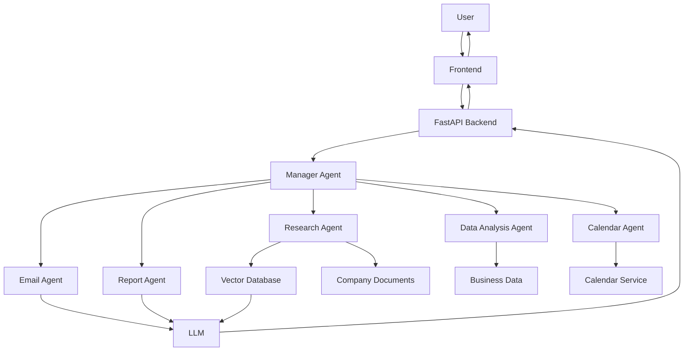
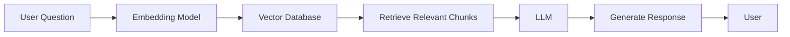

# 🤖 Multi-Agent AI Business Assistant

> **An enterprise-grade Multi-Agent AI Business Assistant that leverages specialized AI agents and Retrieval-Augmented Generation (RAG) to automate business operations such as research, document analysis, report generation, email drafting, scheduling, and intelligent decision support.**

---

# 📌 Project Overview

The **Multi-Agent AI Business Assistant** is a next-generation enterprise AI solution designed to improve productivity by automating repetitive business tasks through collaboration between multiple specialized Artificial Intelligence agents.

Unlike traditional AI chatbots that rely on a single language model to perform every task, this system adopts a **Multi-Agent Architecture**, where each AI agent is responsible for a specific business function. A central **Manager Agent** coordinates these specialized agents, assigns tasks, gathers their outputs, and generates a unified response for the user.

The project is intended to support organizations in reducing manual effort, improving operational efficiency, and enabling employees to access information and complete routine tasks more quickly.

To improve the accuracy and reliability of responses, the proposed system integrates **Retrieval-Augmented Generation (RAG)**. Instead of relying solely on the knowledge already present in a Large Language Model (LLM), the system retrieves relevant information from company documents, knowledge bases, and databases before generating a response. This significantly reduces hallucinations and ensures that answers are based on verified organizational data.

The proposed solution can be applied across various industries, including corporate enterprises, healthcare organizations, educational institutions, financial services, customer support centers, and government agencies.

This repository currently represents the **project proposal and system design**. Development of the application will follow after the design phase is finalized.

---

# 🎯 Problem Statement

Modern organizations deal with a large volume of repetitive business operations every day. Employees spend significant time searching through documents, preparing reports, responding to emails, analyzing spreadsheets, scheduling meetings, and retrieving information from multiple internal systems.

Although AI chatbots are increasingly used to assist with these activities, most existing solutions rely on a single language model to perform every task. As the complexity of requests increases, these systems often become slower, less organized, and more prone to generating inaccurate or incomplete responses.

Businesses also maintain large collections of internal documents, policies, manuals, and knowledge bases that are continuously updated. Traditional AI models cannot automatically access this latest information, leading to outdated or unreliable answers.

The proposed Multi-Agent AI Business Assistant addresses these challenges by introducing multiple specialized AI agents that collaborate to solve complex business tasks while using Retrieval-Augmented Generation (RAG) to retrieve accurate information directly from organizational knowledge sources.

---

# 🎯 Objectives

The primary objectives of this project are:

- Design an intelligent business assistant based on Multi-Agent AI architecture.
- Automate repetitive business tasks to improve employee productivity.
- Reduce manual effort involved in report generation, email drafting, and information retrieval.
- Integrate Retrieval-Augmented Generation (RAG) for accurate and context-aware responses.
- Enable multiple AI agents to collaborate efficiently on complex business requests.
- Provide a scalable architecture that can easily accommodate additional AI agents in the future.
- Improve the accuracy, transparency, and reliability of AI-generated responses.
- Demonstrate the practical application of Generative AI in enterprise environments.

---

# ❗ Existing System

Most AI-powered business assistants available today are based on a single Large Language Model (LLM). While these systems can answer general questions, they exhibit several limitations when handling enterprise-level workflows.

### Limitations of Existing Systems

- Single AI model responsible for every task.
- Difficulty handling complex multi-step workflows.
- Higher probability of hallucinated responses.
- Limited access to organization-specific information.
- Poor coordination across different business functions.
- Reduced scalability as new capabilities are added.
- Lack of specialization for individual business tasks.
- Limited transparency regarding how responses are generated.

These limitations motivate the need for a more structured and collaborative AI architecture.

---

# 💡 Proposed System

The proposed system introduces a collaborative ecosystem of specialized AI agents, each responsible for a dedicated business function.

Instead of expecting one AI model to perform every task, the system distributes work among expert agents such as the Research Agent, Email Agent, Report Agent, Data Analysis Agent, and Calendar Agent.

A central **Manager Agent** receives the user's request, determines which agents should participate, distributes subtasks accordingly, and combines their outputs into a final response.

To ensure factual accuracy, the system integrates Retrieval-Augmented Generation (RAG), allowing AI agents to retrieve relevant information from organizational documents before generating responses.

This architecture enables the system to provide faster, more accurate, scalable, and explainable assistance for enterprise users.

---

# 🌍 Potential Applications

The proposed system can be used in various domains, including:

- Corporate Enterprises
- Customer Support Centers
- Banking and Financial Services
- Healthcare Organizations
- Educational Institutions
- Human Resource Management
- Legal Firms
- Government Organizations
- Software Development Companies
- Business Consulting Firms
---

# ✨ Key Features

The proposed **Multi-Agent AI Business Assistant** is designed to automate a wide range of business operations through collaboration between multiple specialized AI agents. Instead of relying on a single AI model, each agent performs a dedicated task based on its expertise, allowing the system to provide accurate, organized, and efficient responses.

The major features planned for this system include:

- Multi-Agent Collaboration
- Intelligent Task Routing
- Retrieval-Augmented Generation (RAG)
- Document Understanding
- Business Report Generation
- Professional Email Drafting
- Spreadsheet and Data Analysis
- Meeting Scheduling Assistance
- Semantic Search
- Conversation Memory
- Multi-format Document Processing
- Modular and Scalable Architecture
- User Authentication
- Dashboard for Activity Monitoring
- Future Support for Voice Interaction
- Future Support for Multi-language Communication

These features aim to improve productivity, reduce manual effort, and provide intelligent assistance across different business functions.

---

# 🤖 Multi-Agent Architecture

Unlike conventional AI chatbots, the proposed system consists of multiple intelligent software agents working together.

Each agent specializes in one business function while a central **Manager Agent** coordinates communication between all agents.

This architecture follows the principle of **divide and solve**, where a complex business request is divided into smaller tasks and assigned to specialized agents.

The proposed architecture increases scalability, improves response quality, and allows new AI agents to be added in the future without redesigning the entire system.

---

# 🧠 Manager Agent

The **Manager Agent** acts as the central controller of the entire system.

It is responsible for understanding the user's request, identifying which specialized agents are required, distributing tasks, monitoring their execution, collecting their outputs, and generating the final response.

Rather than performing every task itself, the Manager Agent works as an intelligent coordinator.

### Responsibilities

- Receive user requests
- Analyze user intent
- Select appropriate AI agents
- Divide complex tasks
- Coordinate communication between agents
- Merge responses from different agents
- Deliver the final answer

Without the Manager Agent, communication between multiple AI agents would become unorganized and inefficient.

---

# 📚 Research Agent

The Research Agent is responsible for collecting relevant information from both internal and external knowledge sources.

Whenever users ask factual or information-based questions, this agent retrieves the required information before sending it to the language model for response generation.

This agent forms the foundation of the Retrieval-Augmented Generation (RAG) pipeline.

### Responsibilities

- Search company documents
- Retrieve relevant knowledge
- Search internal databases
- Perform semantic search
- Retrieve document references
- Support accurate answer generation

Example Tasks

- Find company policies
- Search employee handbook
- Retrieve product documentation
- Locate technical manuals
- Find HR regulations

---

# 📄 Report Generation Agent

Many organizations spend significant time preparing reports.

The Report Agent automates this process by generating structured reports using information collected from different sources.

The reports can include summaries, analytics, recommendations, and business insights.

### Responsibilities

- Generate business reports
- Create summaries
- Prepare meeting reports
- Produce executive summaries
- Organize business information

Example Outputs

- Weekly Reports
- Monthly Reports
- Sales Reports
- Employee Reports
- Meeting Minutes

---

# 📧 Email Agent

Professional email communication consumes a considerable amount of employee time.

The Email Agent assists users by automatically drafting professional emails based on user instructions.

It can also rewrite, summarize, and improve existing emails.

### Responsibilities

- Compose professional emails
- Generate replies
- Improve writing quality
- Summarize email conversations
- Maintain professional tone

Example Tasks

- Leave request emails
- Client response emails
- Meeting invitations
- HR communication
- Follow-up emails

---

# 📊 Data Analysis Agent

Organizations frequently work with Excel spreadsheets, CSV files, and business data.

The Data Analysis Agent helps users understand their data by generating insights, summaries, and visualizations.

### Responsibilities

- Analyze spreadsheets
- Generate statistical summaries
- Identify trends
- Create business insights
- Detect anomalies
- Generate charts

Example Tasks

- Sales analysis
- Employee attendance analysis
- Financial summaries
- Inventory reports
- Customer analytics

---

# 📅 Calendar & Scheduling Agent

Managing meetings and appointments manually can become time-consuming.

The Calendar Agent assists users by organizing schedules and planning meetings.

### Responsibilities

- Schedule meetings
- Suggest available time slots
- Manage reminders
- Organize calendars
- Create daily schedules

Example Tasks

- Book meetings
- Set reminders
- Schedule interviews
- Organize team discussions

---

# 💻 Coding Assistant Agent (Future Module)

This optional AI agent is intended to support software development teams.

It can assist developers by generating code, reviewing programs, explaining algorithms, and debugging errors.

### Responsibilities

- Generate code
- Explain code
- Detect bugs
- Suggest improvements
- Generate documentation

Example Tasks

- Python programming
- SQL queries
- API development
- Code optimization
- Debugging

---

# ⚙️ Agent Collaboration Workflow

The major strength of the proposed system is collaboration between multiple AI agents.

Instead of one AI model performing every task, the Manager Agent distributes responsibilities to specialized agents.

For example:

**User Request:**

> "Analyze the uploaded sales report, prepare a business summary, and draft an email for management."

The workflow would be:

1. Manager Agent receives the request.
2. Data Analysis Agent analyzes the sales spreadsheet.
3. Research Agent retrieves supporting company information if required.
4. Report Agent prepares the business summary.
5. Email Agent drafts a professional email.
6. Manager Agent combines all outputs.
7. Final response is delivered to the user.

This collaborative workflow enables the system to solve complex business problems efficiently while maintaining modularity and scalability.
---

# 🏗️ Proposed System Architecture

The proposed Multi-Agent AI Business Assistant follows a modular architecture in which each component has a dedicated responsibility. The architecture is designed to be scalable, maintainable, and easy to extend as new AI capabilities are added.

The system consists of five primary layers:

1. Presentation Layer (Frontend)
2. Application Layer (Backend)
3. Multi-Agent Intelligence Layer
4. Knowledge & Data Layer
5. AI Model Layer

The user interacts with the application through a web interface. The backend receives requests, forwards them to the Manager Agent, which coordinates the specialized AI agents. Depending on the user's request, the appropriate agent retrieves information, performs reasoning, and generates the required output.

---

# 🏛 High-Level Architecture



The Manager Agent acts as the central coordinator and ensures that specialized AI agents collaborate efficiently to complete user requests.

---

# 🧠 Retrieval-Augmented Generation (RAG)

One of the core components of the proposed system is Retrieval-Augmented Generation (RAG).

Traditional Large Language Models generate responses based only on their training data. This often results in outdated or inaccurate answers when users ask questions related to company-specific information.

To overcome this limitation, the proposed system will retrieve relevant information from organizational documents before generating a response.

This approach significantly improves response accuracy while reducing hallucinations.

---

# 🔄 Proposed RAG Workflow



---

# 📄 Document Processing Pipeline

Before the AI can answer questions from company documents, the uploaded files must be processed.

The proposed document processing workflow consists of the following stages:

1. Document Upload
2. Text Extraction
3. Text Cleaning
4. Chunk Generation
5. Embedding Generation
6. Vector Storage
7. Semantic Retrieval

Supported document types may include:

- PDF
- DOCX
- TXT
- CSV
- Excel
- PowerPoint

---

# 🔍 Semantic Search

Instead of searching documents using exact keywords, the proposed system will use semantic search.

Semantic search identifies information based on meaning rather than exact wording.

Example:

User Question:

> "How can I apply for leave?"

Relevant document:

> Employee Leave Policy

Although the exact sentence may not appear inside the document, semantic search understands the meaning and retrieves the correct section.

This improves the quality of document retrieval.

---

# 🎨 Proposed Frontend Design

The frontend will provide an intuitive and responsive interface for interacting with the AI assistant.

Major components include:

- Login Page
- Registration Page
- Dashboard
- AI Chat Interface
- File Upload Page
- Reports Section
- Analytics Dashboard
- User Profile
- Settings

The design will prioritize simplicity, usability, and accessibility.

---

# ⚙️ Proposed Backend Design

The backend will act as the communication bridge between the frontend, AI agents, databases, and language models.

Major responsibilities include:

- Authentication
- Request Processing
- AI Agent Coordination
- Document Processing
- Vector Search
- API Management
- Database Operations
- Session Management

The backend will expose REST APIs for all frontend interactions.

---

# 🗂 Database Design

The proposed database will manage application data including users, uploaded files, chat history, reports, and system logs.

The primary entities include:

### Users

Stores:

- User ID
- Name
- Email
- Password
- Role

---

### Chats

Stores:

- Chat ID
- User ID
- Prompt
- AI Response
- Timestamp

---

### Documents

Stores:

- Document Name
- Upload Date
- Owner
- Document Type
- Processing Status

---

### Reports

Stores:

- Generated Reports
- Report Type
- Creation Date
- Download Status

---

### Activity Logs

Stores:

- User Activities
- Login History
- AI Requests
- Errors

This structured database design supports scalability and efficient data management.

---

# 🧰 Proposed Technology Stack

| Layer | Planned Technology | Purpose |
|--------|-------------------|---------|
| Frontend | React.js | User Interface |
| Styling | Tailwind CSS | Responsive Design |
| Backend | FastAPI | REST API Development |
| Programming Language | Python | AI & Backend Development |
| Authentication | JWT | Secure User Authentication |
| Database | PostgreSQL | Structured Data Storage |
| Vector Database | ChromaDB | Semantic Search |
| AI Framework | LangGraph | Multi-Agent Coordination |
| LLM | Gemini API | Natural Language Generation |
| Embedding Model | Gemini Embeddings | Semantic Representation |
| Version Control | Git & GitHub | Source Code Management |
| Deployment | Docker | Containerization |

---

# 📁 Proposed Folder Structure

```
Multi-Agent-AI-Business-Assistant/

│

├── frontend/

│ ├── components/

│ ├── pages/

│ ├── assets/

│ ├── hooks/

│ └── services/

│

├── backend/

│ ├── agents/

│ ├── api/

│ ├── authentication/

│ ├── rag/

│ ├── database/

│ ├── models/

│ ├── services/

│ └── utils/

│

├── documents/

├── prompts/

├── deployment/

├── docs/

├── README.md

└── requirements.txt
```

---

# 🌐 Planned API Endpoints

The backend is expected to expose REST APIs for communication between the frontend and the AI services.

Examples include:

| Method | Endpoint | Purpose |
|---------|----------|----------|
| POST | /login | User Authentication |
| POST | /register | Create Account |
| POST | /chat | Send User Prompt |
| POST | /upload | Upload Documents |
| GET | /documents | Retrieve Uploaded Files |
| GET | /reports | Retrieve Generated Reports |
| POST | /generate-report | Generate Business Report |
| POST | /generate-email | Draft Professional Email |
| GET | /history | Retrieve Chat History |

These APIs represent the planned communication layer for the proposed system.
